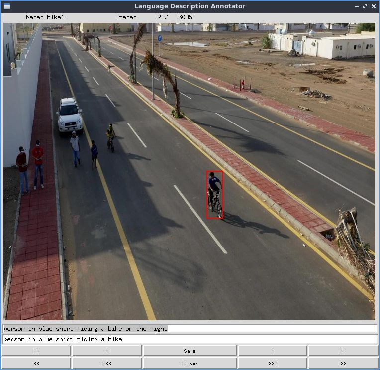

# LVLT: Long-term Vision-Language Tracking
We annotate the popular long-term tracking dataset, LTB50, with dense language descriptions.
Based on this language-annotated dataset, we extend traditional long-term visual tracking to long-term vision-language tracking (LVLT).

## Language Description Annotator
We also provide an annotation toolkit, which is developed with the [tkinter](https://docs.python.org/3/library/tkinter.html) package.
```commandline
python -m lib.gui 
```
- key`Up` and `Down` (button`|<` abd `>|`): choose video
- key`Left` and `Right` (button`<` abd `>`): choose frame
- key`Enter` (button`Save`): save the description of current frame
- `Text Box`: The upper one shows the last description, the lower one is used to annotate the current frame. 
You can fill the lower one with a language description and click the save button (or press the `Enter` key).
